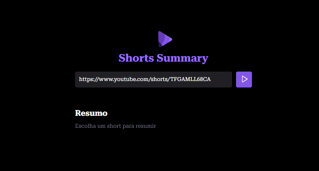

<h1 align="center"> Projeto Short Summary </h1>

Meu primeiro projeto usando Inteligência Artificial com a Rocketseat!   

  <a href="#-tecnologias">Tecnologias</a>&nbsp;&nbsp;&nbsp;&nbsp;&nbsp;&nbsp;

 

  

## 🚀 Tecnologias

Esse projeto foi desenvolvido com as seguintes tecnologias:

- HTML e CSS
- JavaScript
- Node.js
- Inteligência artificial (IA)
- Hugging Face
- Git e Github
- Figma

## 💻 Projeto

O Projeto envolve a criação de um site capaz de resumir vídeos do tipo shorts do YouTube.

## :memo: Licença

Esse projeto está sob a licença MIT.

---

Agradeço imensamente à Rocketseat por proporcionar essa incrível oportunidade de aprendizado! 🚀💜 

